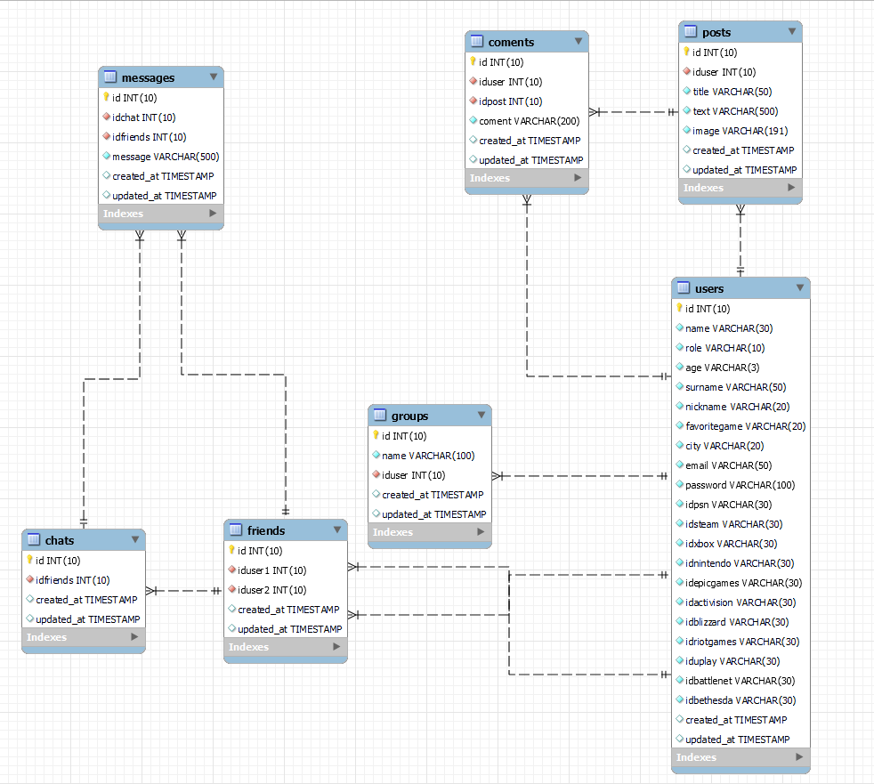

<p align="center"><a href="https://laravel.com" target="_blank"></a></p>

<p align="center">
<a href="https://travis-ci.org/laravel/framework"></a>
<a href="https://packagist.org/packages/laravel/framework"></a>
<a href="https://packagist.org/packages/laravel/framework"></a>
<a href="https://packagist.org/packages/laravel/framework"></a>
</p>

<br>
<p aling="center">
  
</p>

# FrontedGAMES Tu red social de videojuegos 2022


Tu red social de videojuegos, parte Backend ,se utilizan las tecnologías🔧 : 
* Laravel⚙️
* Passport⚙️
* Composer⚙️
* PHP⚙️
* Postman para pruebas locales⚙️
* Mysql⚙️
* Heroku⚙️
 
 #

* 🌐 Enlace AWS:https://main.d1zdk2h0thz2b5.amplifyapp.com/ parte frontal

* 🌐 Deploy Heroku https://acefrontedgames.herokuapp.com/
#
### 👇Aqui se pueden ver las relaciones entre las tablas de la BBDD.👇

<br>
<p aling="center">
  
</p>

## ENDPOINTS DE LA API⚙️

```
 User ----> Registro de nuevo user /api/newUser

           - Inicio sesión /api/loginUser

           - Actualizar perfil /api/User (debe incluirse el token del usuario a 
             modificar).

           - Borrar usuario /api/User/"introducir la id" sin comillas(debe
             incluirse el token del usuario a eliminar).
```
```
 Friends ----> Crear amistad entre dos usuarios /api/Friend (debe incluirse en el body las dos id y el token del usuario que hace la función post)
               {
                "iduser1": 181,(el que quiere agregar al iduser 2)
                "iduser2": 111 (al que añades como amigo)
               }
```

```
Chat ----> Para crear un chat entre dos amigos: /api/Chat
 (debe incluirse en el body lo siguiente):
            {
                "idfriends": se incluye el ID generado al crear la amistad  (Usando el token de quien genera el chat)
            }
```
```
Message ----> Para crear un mensaje en el chat de dos amigos /api/Message
(debe incluirse en el body lo siguiente):
    {
        "idchat": 21, (debe incluir el id del chat creado anteriormente)
        "idfriends":31, (debe incluir el id del amigo al que vas a enviar el mensaje)
        "message":"Hola amigo " (debe incluir el token del user que manda el mensaje)
    }
```
```
Posts ---->  /api/Post (Para crear un post debe tener el siguiente body):
(Debe incluir el token de quien lo crea).

    {
      
        "title": "nuevopost",
        "text": "hola esto es un nuevo post",
        "image": "imagen aquí"
    }
```

```
Coment ----> Para crear un nuevo comentario   /api/Coment
(Debe incluir el siguiente body y el token)

    {
        "iduser": 151,(El id del usuario que comenta)
        "idpost": 131, (El id del post que se ha creado y en el cual comentas)
        "coment": "Yo te ayudo"(El texto)
    }
```
## ℹ️IMPLEMENTACIÓN DE SEGURIDAD EN LA API: PASSPORT
* Se instala passport en el proyecto con los siguientes comandos:💻
```
*composer require laravel/passport
*php artisan passport:install
*php artisan --force passport_install (para crear las keys especiales necesarias para el funcionamiento)
*Creamos AuthController, donde se añaden las funciones de registro de nuevo usuario, de login y de logout.
```
##
<h4>GUIA INSTALACIÓN PASSPORT📔</h4>

https://programacionymas.com/blog/api-rest-laravel-passport

# Autor ✒️ 
* #### Arnold Carcelén - Desarrollo de la APP y documentación.
